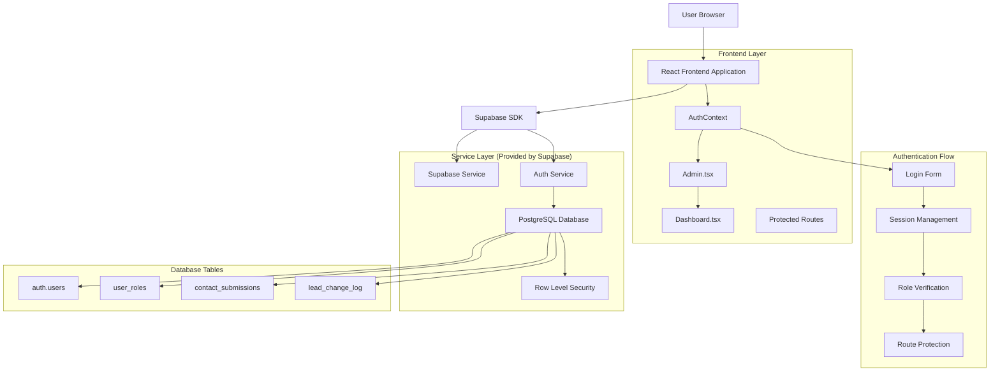
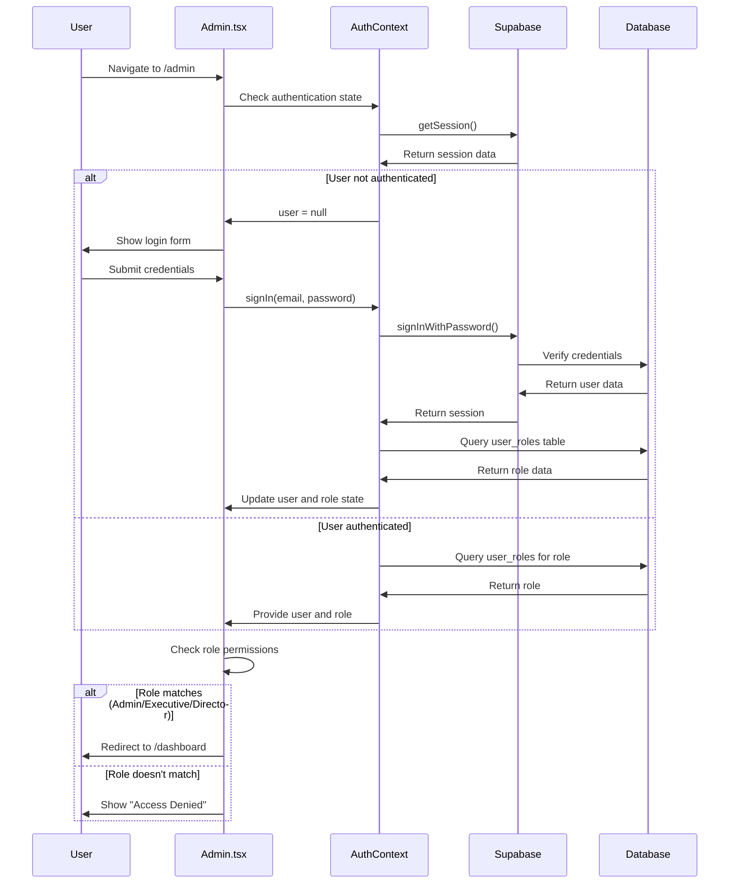
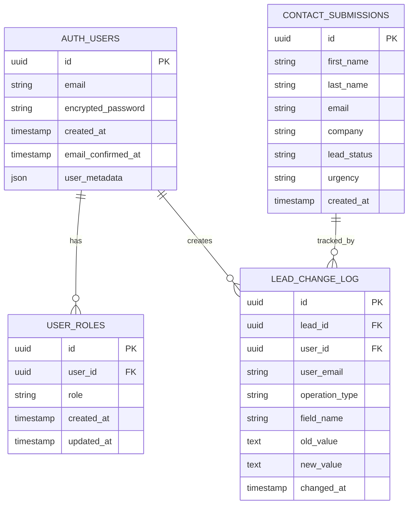
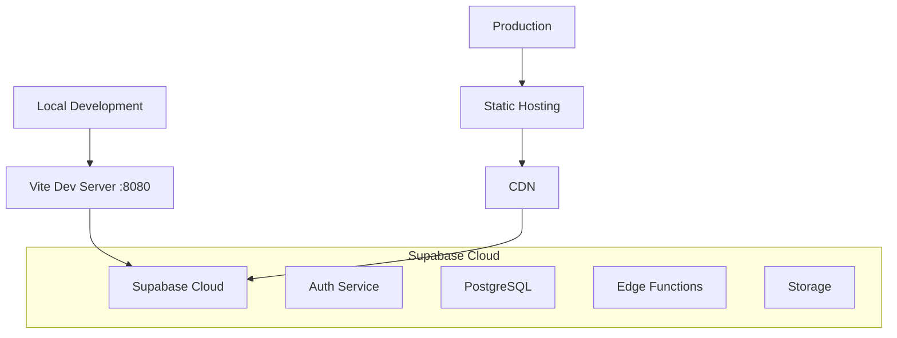

# ImpTrax Technical Architecture Analysis

## 1. Architecture Design



## 2. Technology Description

- **Frontend**: React@18 + TypeScript + Vite + TailwindCSS
- **Backend**: Supabase (PostgreSQL + Auth + RLS)
- **Authentication**: Supabase Auth with custom role management
- **State Management**: React Context (AuthContext)
- **Routing**: React Router v6
- **UI Components**: Shadcn/ui + Lucide React icons

## 3. Route Definitions

| Route | Purpose | Protection Level |
|-------|---------|------------------|
| `/admin` | Admin login page | Public (redirects if authenticated) |
| `/dashboard` | Main admin dashboard | Protected (Admin/Executive/Director only) |
| `/dashboard/leads` | Lead management | Protected (Admin/Executive/Director only) |
| `/dashboard/settings/profile` | User profile settings | Protected (Authenticated users) |
| `/dashboard/settings/password` | Password management | Protected (Authenticated users) |
| `/dashboard/settings/roles` | Role management | Protected (Admin only) |
| `/dashboard/settings/users` | User management | Protected (Admin only) |

## 4. Authentication Flow Analysis

### 4.1 Current Authentication Process



### 4.2 Identified Issues in Current Flow

1. **Role Case Sensitivity**: Frontend expects capitalized roles, database stores lowercase
2. **RLS Policy Conflicts**: Multiple overlapping policies causing query failures
3. **Timing Issues**: Race conditions between session and role fetching
4. **Error Handling**: Insufficient retry logic for failed role queries

## 5. Database Schema Analysis

### 5.1 Data Model Definition



### 5.2 Current RLS Policies Issues

**Problematic Policies:**
```sql
-- These policies create recursion issues
CREATE POLICY "Admins can view all roles" ON public.user_roles
    FOR SELECT USING (
        EXISTS (
            SELECT 1 FROM public.user_roles ur 
            WHERE ur.user_id = auth.uid() AND ur.role = 'admin'
        )
    );
```

**Recommended Simplified Policies:**
```sql
-- Simple, non-recursive policies
CREATE POLICY "Allow authenticated users to read roles" ON public.user_roles
    FOR SELECT TO authenticated USING (true);

CREATE POLICY "Allow authenticated users to manage roles" ON public.user_roles
    FOR ALL TO authenticated USING (true) WITH CHECK (true);
```

## 6. Critical Issues & Solutions

### 6.1 Role Case Sensitivity Fix

**Problem**: Admin.tsx expects `'Admin'`, database has `'admin'`

**Solution Options:**

**Option A: Frontend Fix (Recommended)**
```typescript
// In Admin.tsx - make role checking case-insensitive
const allowedRoles = ['admin', 'executive', 'director'];
const hasAccess = userRole && allowedRoles.includes(userRole.toLowerCase());
```

**Option B: Database Fix**
```sql
-- Update database to match frontend expectations
UPDATE user_roles SET role = 'Admin' WHERE role = 'admin';
UPDATE user_roles SET role = 'Executive' WHERE role = 'executive';
UPDATE user_roles SET role = 'Director' WHERE role = 'director';
```

### 6.2 RLS Policy Cleanup

```sql
-- Remove all conflicting policies
DROP POLICY IF EXISTS "Users can view their own role" ON public.user_roles;
DROP POLICY IF EXISTS "Admins can view all roles" ON public.user_roles;
DROP POLICY IF EXISTS "Authenticated read all roles" ON public.user_roles;
DROP POLICY IF EXISTS "Authenticated manage roles" ON public.user_roles;

-- Create clean, simple policies
CREATE POLICY "authenticated_read_roles" ON public.user_roles
    FOR SELECT TO authenticated USING (true);

CREATE POLICY "authenticated_manage_roles" ON public.user_roles
    FOR ALL TO authenticated USING (true) WITH CHECK (true);
```

### 6.3 AuthContext Improvements

```typescript
// Enhanced getUserRole with retry logic
const getUserRole = async (userId: string, retryCount = 0): Promise<string | null> => {
  try {
    const { data, error } = await supabase
      .from('user_roles')
      .select('role')
      .eq('user_id', userId)
      .single();
    
    if (error) {
      if (retryCount < 3) {
        console.warn(`Role fetch retry ${retryCount + 1}/3`);
        await new Promise(resolve => setTimeout(resolve, 1000));
        return getUserRole(userId, retryCount + 1);
      }
      console.error('Failed to fetch user role after retries:', error);
      return null;
    }
    
    return data?.role || null;
  } catch (error) {
    console.error('getUserRole exception:', error);
    return null;
  }
};
```

## 7. Security Considerations

### 7.1 Current Security Measures
- Supabase Auth handles password hashing and session management
- Row Level Security (RLS) enabled on all tables
- JWT tokens for session management
- Role-based access control

### 7.2 Security Improvements Needed
- Simplify RLS policies to reduce attack surface
- Add rate limiting for login attempts
- Implement session timeout
- Add audit logging for admin actions

## 8. Performance Considerations

### 8.1 Current Performance Issues
- Multiple role queries due to RLS recursion
- Timeout fallbacks causing delays
- Inefficient policy evaluation

### 8.2 Performance Optimizations
- Cache role data in AuthContext
- Simplify RLS policies
- Add database indexes for role queries
- Implement proper loading states

## 9. Deployment Architecture



## 10. Monitoring & Debugging

### 10.1 Current Debug Tools
- `debug_user_role.js` - Role debugging script
- `create_admin_user.js` - Admin user creation
- Browser console logging in AuthContext

### 10.2 Recommended Monitoring
- Supabase Dashboard for auth metrics
- Database query performance monitoring
- Frontend error tracking (Sentry)
- Authentication success/failure rates

## 11. Next Steps

1. **Immediate**: Fix role case sensitivity issue
2. **Critical**: Clean up RLS policies
3. **High**: Improve AuthContext reliability
4. **Medium**: Add comprehensive testing
5. **Low**: Implement monitoring and alerting

This technical analysis provides the foundation for resolving the authentication issues and improving the overall system reliability.