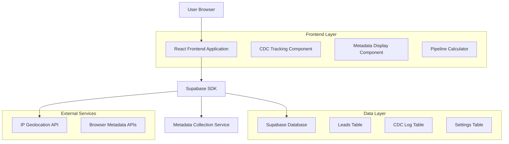
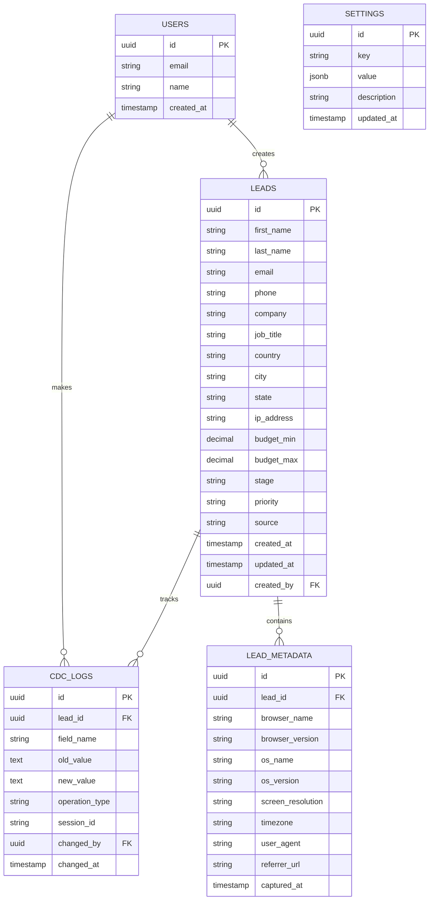

# Leads Management System - Technical Architecture Document

## 1. Architecture Design



## 2. Technology Description

* Frontend: React\@18 + TypeScript + Tailwind CSS + Vite

* Backend: Supabase (PostgreSQL + Auth + Real-time)

* External APIs: IP Geolocation service for location extraction

* State Management: React hooks + Supabase real-time subscriptions

## 3. Route Definitions

| Route      | Purpose                                                 |
| ---------- | ------------------------------------------------------- |
| /leads     | Main leads management page with list view and filtering |
| /leads/:id | Lead detail view with metadata and CDC tracking         |
| /settings  | Settings configuration page                             |
| /profile   | User profile management                                 |

## 4. API Definitions

### 4.1 Core API

**Lead Management**

```
GET /api/leads
```

Response:

| Param Name | Param Type | Description                         |
| ---------- | ---------- | ----------------------------------- |
| leads      | Lead\[]    | Array of lead objects with metadata |
| total      | number     | Total count of leads                |

**CDC Tracking**

```
POST /api/leads/:id/changes
```

Request:

| Param Name  | Param Type | isRequired | Description             |
| ----------- | ---------- | ---------- | ----------------------- |
| field\_name | string     | true       | Name of changed field   |
| old\_value  | string     | false      | Previous value          |
| new\_value  | string     | true       | New value               |
| session\_id | string     | true       | User session identifier |

**IP Geolocation**

```
GET /api/geolocation/:ip
```

Response:

| Param Name | Param Type | Description          |
| ---------- | ---------- | -------------------- |
| city       | string     | City name            |
| state      | string     | State/province       |
| country    | string     | Country name         |
| latitude   | number     | Geographic latitude  |
| longitude  | number     | Geographic longitude |

## 5. Data Model

### 5.1 Data Model Definition



### 5.2 Data Definition Language

**Leads Table Enhancement**

```sql
-- Add missing columns to leads table
ALTER TABLE leads ADD COLUMN IF NOT EXISTS ip_address VARCHAR(45);
ALTER TABLE leads ADD COLUMN IF NOT EXISTS budget_min DECIMAL(12,2);
ALTER TABLE leads ADD COLUMN IF NOT EXISTS budget_max DECIMAL(12,2);
ALTER TABLE leads ADD COLUMN IF NOT EXISTS stage VARCHAR(20) DEFAULT 'new';
ALTER TABLE leads ADD COLUMN IF NOT EXISTS priority VARCHAR(10) DEFAULT 'medium';

-- Update stage constraint to include disqualified
ALTER TABLE leads DROP CONSTRAINT IF EXISTS leads_stage_check;
ALTER TABLE leads ADD CONSTRAINT leads_stage_check 
    CHECK (stage IN ('new', 'contacted', 'qualified', 'converted', 'lost', 'disqualified'));

-- Add priority constraint
ALTER TABLE leads ADD CONSTRAINT leads_priority_check 
    CHECK (priority IN ('low', 'medium', 'high'));

-- Create indexes for performance
CREATE INDEX IF NOT EXISTS idx_leads_stage ON leads(stage);
CREATE INDEX IF NOT EXISTS idx_leads_priority ON leads(priority);
CREATE INDEX IF NOT EXISTS idx_leads_created_at ON leads(created_at DESC);
```

**CDC Logs Table**

```sql
-- Create CDC logs table
CREATE TABLE IF NOT EXISTS cdc_logs (
    id UUID PRIMARY KEY DEFAULT gen_random_uuid(),
    lead_id UUID REFERENCES leads(id) ON DELETE CASCADE,
    field_name VARCHAR(100) NOT NULL,
    old_value TEXT,
    new_value TEXT,
    operation_type VARCHAR(20) DEFAULT 'UPDATE',
    session_id VARCHAR(100),
    changed_by UUID REFERENCES auth.users(id),
    changed_at TIMESTAMP WITH TIME ZONE DEFAULT NOW()
);

-- Create indexes
CREATE INDEX idx_cdc_logs_lead_id ON cdc_logs(lead_id);
CREATE INDEX idx_cdc_logs_changed_at ON cdc_logs(changed_at DESC);

-- Grant permissions
GRANT SELECT ON cdc_logs TO anon;
GRANT ALL PRIVILEGES ON cdc_logs TO authenticated;
```

**Lead Metadata Table**

```sql
-- Create lead metadata table
CREATE TABLE IF NOT EXISTS lead_metadata (
    id UUID PRIMARY KEY DEFAULT gen_random_uuid(),
    lead_id UUID REFERENCES leads(id) ON DELETE CASCADE,
    browser_name VARCHAR(50),
    browser_version VARCHAR(20),
    os_name VARCHAR(50),
    os_version VARCHAR(20),
    screen_resolution VARCHAR(20),
    timezone VARCHAR(50),
    user_agent TEXT,
    referrer_url TEXT,
    captured_at TIMESTAMP WITH TIME ZONE DEFAULT NOW()
);

-- Create indexes
CREATE INDEX idx_lead_metadata_lead_id ON lead_metadata(lead_id);

-- Grant permissions
GRANT SELECT ON lead_metadata TO anon;
GRANT ALL PRIVILEGES ON lead_metadata TO authenticated;
```

**Settings Table**

```sql
-- Create settings table
CREATE TABLE IF NOT EXISTS settings (
    id UUID PRIMARY KEY DEFAULT gen_random_uuid(),
    key VARCHAR(100) UNIQUE NOT NULL,
    value JSONB NOT NULL,
    description TEXT,
    updated_at TIMESTAMP WITH TIME ZONE DEFAULT NOW()
);

-- Create indexes
CREATE INDEX idx_settings_key ON settings(key);

-- Grant permissions
GRANT SELECT ON settings TO anon;
GRANT ALL PRIVILEGES ON settings TO authenticated;

-- Insert default settings
INSERT INTO settings (key, value, description) VALUES
('pipeline_stages', '["new", "contacted", "qualified", "converted", "lost", "disqualified"]', 'Available lead stages'),
('priority_levels', '["low", "medium", "high"]', 'Available priority levels'),
('budget_ranges', '{"ranges": [{"min": 5000, "max": 25000, "probability": 0.1}, {"min": 25000, "max": 100000, "probability": 0.3}, {"min": 100000, "max": 500000, "probability": 0.5}]}', 'Budget ranges with conversion probabilities')
ON CONFLICT (key) DO NOTHING;
```

**Test Data Cleanup and Insertion**

```sql
-- Truncate leads table (keeping structure)
TRUNCATE TABLE leads RESTART IDENTITY CASCADE;

-- Insert test data for today (5 leads)
INSERT INTO leads (first_name, last_name, email, phone, company, job_title, country, city, state, ip_address, budget_min, budget_max, stage, priority, source, created_at) VALUES
('James', 'Anderson', 'james.anderson@techcorp.com', '+1-555-0101', 'TechCorp Solutions', 'CTO', 'United States', 'San Francisco', 'California', '192.168.1.100', 50000, 150000, 'new', 'high', 'website', NOW()),
('Sarah', 'Williams', 'sarah.williams@innovate.co.uk', '+44-20-7946-0958', 'Innovate Ltd', 'Marketing Director', 'United Kingdom', 'London', 'England', '192.168.1.101', 25000, 75000, 'contacted', 'medium', 'referral', NOW()),
('Michael', 'Thompson', 'michael.thompson@globaltech.ca', '+1-416-555-0123', 'GlobalTech Inc', 'VP Sales', 'Canada', 'Toronto', 'Ontario', '192.168.1.102', 100000, 300000, 'qualified', 'high', 'linkedin', NOW()),
('Emma', 'Davis', 'emma.davis@startupco.com', '+1-555-0145', 'StartupCo', 'Founder', 'United States', 'Austin', 'Texas', '192.168.1.103', 15000, 50000, 'new', 'medium', 'google_ads', NOW()),
('Robert', 'Wilson', 'robert.wilson@enterprise.com.au', '+61-2-9876-5432', 'Enterprise Solutions', 'IT Manager', 'Australia', 'Sydney', 'New South Wales', '192.168.1.104', 75000, 200000, 'contacted', 'high', 'website', NOW());

-- Insert test data for last week (5 leads)
INSERT INTO leads (first_name, last_name, email, phone, company, job_title, country, city, state, ip_address, budget_min, budget_max, stage, priority, source, created_at) VALUES
('Jennifer', 'Brown', 'jennifer.brown@techstart.com', '+1-555-0167', 'TechStart Ventures', 'CEO', 'United States', 'Seattle', 'Washington', '192.168.1.105', 200000, 500000, 'qualified', 'high', 'conference', NOW() - INTERVAL '7 days'),
('David', 'Miller', 'david.miller@ukbusiness.co.uk', '+44-161-496-0123', 'UK Business Solutions', 'Operations Manager', 'United Kingdom', 'Manchester', 'England', '192.168.1.106', 30000, 80000, 'converted', 'medium', 'email_campaign', NOW() - INTERVAL '7 days'),
('Lisa', 'Garcia', 'lisa.garcia@cantech.ca', '+1-604-555-0189', 'CanTech Systems', 'Product Manager', 'Canada', 'Vancouver', 'British Columbia', '192.168.1.107', 40000, 120000, 'lost', 'low', 'social_media', NOW() - INTERVAL '7 days'),
('Christopher', 'Jones', 'chris.jones@digitalcorp.com', '+1-555-0198', 'Digital Corp', 'Head of Technology', 'United States', 'New York', 'New York', '192.168.1.108', 150000, 400000, 'disqualified', 'low', 'website', NOW() - INTERVAL '7 days'),
('Amanda', 'Taylor', 'amanda.taylor@aussietech.com.au', '+61-3-9876-5432', 'AussieTech Pty Ltd', 'Business Development', 'Australia', 'Melbourne', 'Victoria', '192.168.1.109', 60000, 180000, 'contacted', 'medium', 'referral', NOW() - INTERVAL '7 days');

-- Insert test data for last month (5 leads)
INSERT INTO leads (first_name, last_name, email, phone, company, job_title, country, city, state, ip_address, budget_min, budget_max, stage, priority, source, created_at) VALUES
('Matthew', 'White', 'matthew.white@enterprise.com', '+1-555-0201', 'Enterprise Dynamics', 'CFO', 'United States', 'Chicago', 'Illinois', '192.168.1.110', 300000, 500000, 'converted', 'high', 'partnership', NOW() - INTERVAL '30 days'),
('Sophie', 'Clark', 'sophie.clark@londontech.co.uk', '+44-20-7123-4567', 'London Tech Hub', 'Strategy Director', 'United Kingdom', 'London', 'England', '192.168.1.111', 80000, 250000, 'qualified', 'high', 'webinar', NOW() - INTERVAL '30 days'),
('Daniel', 'Lewis', 'daniel.lewis@maple.ca', '+1-514-555-0234', 'Maple Innovations', 'Technical Lead', 'Canada', 'Montreal', 'Quebec', '192.168.1.112', 45000, 130000, 'lost', 'medium', 'cold_email', NOW() - INTERVAL '30 days'),
('Rachel', 'Martin', 'rachel.martin@westcoast.com', '+1-555-0245', 'West Coast Solutions', 'VP Marketing', 'United States', 'Los Angeles', 'California', '192.168.1.113', 70000, 200000, 'disqualified', 'low', 'trade_show', NOW() - INTERVAL '30 days'),
('Thomas', 'Robinson', 'thomas.robinson@sydneytech.com.au', '+61-2-8765-4321', 'Sydney Tech Group', 'Innovation Manager', 'Australia', 'Sydney', 'New South Wales', '192.168.1.114', 90000, 280000, 'contacted', 'medium', 'linkedin', NOW() - INTERVAL '30 days');
```

## 6. Implementation Components

### 6.1 Metadata Collection Service

```typescript
interface BrowserMetadata {
  browserName: string;
  browserVersion: string;
  osName: string;
  osVersion: string;
  screenResolution: string;
  timezone: string;
  userAgent: string;
  referrerUrl: string;
}

function collectBrowserMetadata(): BrowserMetadata {
  // Implementation for collecting browser and system metadata
}
```

### 6.2 CDC Tracking Service

```typescript
interface CDCLogEntry {
  leadId: string;
  fieldName: string;
  oldValue: string | null;
  newValue: string;
  operationType: 'INSERT' | 'UPDATE' | 'DELETE';
  sessionId: string;
  changedBy: string;
  changedAt: Date;
}

function logFieldChange(entry: CDCLogEntry): Promise<void> {
  // Implementation for logging field changes
}
```

### 6.3 Pipeline Calculator

```typescript
interface PipelineValue {
  stage: string;
  budgetMin: number;
  budgetMax: number;
  probability: number;
  estimatedValue: number;
}

function calculatePipelineValue(lead: Lead): PipelineValue {
  // Implementation for calculating pipeline values based on stage and budget
}
```

