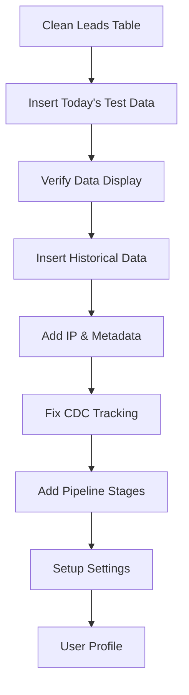

# Leads Management System - Test Plan & Requirements Document

## 1. Product Overview

Comprehensive test plan and requirements for fixing the leads management system with proper test data, metadata tracking, CDC logging, and pipeline calculations. This document outlines a step-by-step approach to resolve all identified issues systematically.

## 2. Core Features

### 2.1 Data Management Requirements

* Clean/truncate all dummy data from leads table only

* Insert realistic test data with proper demographics and metadata

* Implement IP-based location extraction

* Add comprehensive user metadata tracking

### 2.2 Feature Module

Our leads system requirements consist of the following main areas:

1. **Database Cleanup**: Truncate existing dummy data from leads table
2. **Test Data Creation**: Insert 5 leads at a time for different time periods
3. **Metadata Enhancement**: Add expandable/collapsible user metadata section
4. **CDC Tracking**: Fix change data capture logging system
5. **Pipeline Management**: Add disqualified stage and budget-based calculations
6. **Settings Configuration**: Setup settings table structure
7. **User Profile**: Enhance user profile functionality

### 2.3 Page Details

| Page Name        | Module Name         | Feature description                                                                                        |
| ---------------- | ------------------- | ---------------------------------------------------------------------------------------------------------- |
| Leads Management | Data Cleanup        | Truncate all existing dummy data from leads table only                                                     |
| Leads Management | Test Data Insertion | Insert 5 realistic leads for today, last week, last month with white people's names from Western countries |
| Lead Detail View | Metadata Section    | Add expandable/collapsible user metadata showing browser info, IP details, session data                    |
| Lead Detail View | CDC Change Log      | Fix change data capture to properly track and display all field changes                                    |
| Leads Management | Pipeline Stages     | Add 'disqualified' stage to existing stages (new, contacted, qualified, converted, lost)                   |
| Leads Management | Budget Calculations | Implement pipeline value calculations based on budget ranges with percentage allocations                   |
| Settings         | Configuration       | Setup settings table with proper structure and functionality                                               |
| User Profile     | Profile Management  | Add comprehensive user profile functionality in workbench area                                             |

## 3. Core Process

### Phase 1: Database Cleanup & Test Data (High Priority)

1. **Step 1**: Truncate leads table dummy data
2. **Step 2**: Insert 5 test leads for today's date
3. **Step 3**: Verify data appears correctly in leads list
4. **Step 4**: Insert 5 test leads for last week
5. **Step 5**: Insert 5 test leads for last month
6. **Step 6**: Test different priority levels and statuses

### Phase 2: Metadata & Tracking (High Priority)

1. **Step 7**: Add IP address extraction service
2. **Step 8**: Implement city/state/country extraction from IP
3. **Step 9**: Add user metadata collection (browser, device, etc.)
4. **Step 10**: Create expandable/collapsible metadata section in detail view
5. **Step 11**: Fix CDC change tracking system

### Phase 3: Pipeline Enhancement (Medium Priority)

1. **Step 12**: Add 'disqualified' stage to lead statuses
2. **Step 13**: Implement budget-based pipeline calculations
3. **Step 14**: Add percentage-based value allocation

### Phase 4: System Configuration (Low Priority)

1. **Step 15**: Setup settings table structure
2. **Step 16**: Implement user profile functionality

## 4. User Interface Design

### 4.1 Design Style

* Primary colors: Blue (#3B82F6) and Gray (#6B7280)

* Secondary colors: Green (#10B981) for success, Red (#EF4444) for errors

* Button style: Rounded corners with hover effects

* Font: Inter or system fonts, 14px base size

* Layout style: Card-based with clean spacing

* Icons: Lucide React icons for consistency

### 4.2 Page Design Overview

| Page Name        | Module Name      | UI Elements                                                                 |
| ---------------- | ---------------- | --------------------------------------------------------------------------- |
| Lead Detail View | Metadata Section | Expandable card with toggle button, structured data display, proper spacing |
| Lead Detail View | CDC Change Log   | Collapsible section with timestamp, user, field changes in table format     |
| Leads List       | Pipeline Stages  | Color-coded badges for each stage including new 'disqualified' status       |
| Leads List       | Budget Display   | Formatted currency with pipeline value calculations                         |

### 4.3 Responsiveness

Desktop-first design with mobile-adaptive layout, touch-friendly interactions for expandable sections.

## 5. Technical Requirements

### 5.1 Test Data Specifications

* **Names**: White people's names from Western countries (US, UK, Canada, Australia)

* **Companies**: Realistic company names from various industries

* **IP Addresses**: Valid IP addresses from target countries

* **Budgets**: Range from $5,000 to $500,000 for pipeline calculations

* **Stages**: Distribute across all stages including new 'disqualified'

* **Dates**: Today (5 leads), Last week (5 leads), Last month (5 leads)

### 5.2 Metadata Collection

* Browser information (name, version)

* Operating system details

* Screen resolution

* Timezone

* Session ID

* Referrer URL

* User agent string

### 5.3 CDC Requirements

* Track all field changes with timestamps

* Record user who made changes

* Store old and new values

* Display in chronological order

* Real-time updates

### 5.4 Pipeline Calculations

* Budget ranges with percentage allocations

* Stage-based probability multipliers

* Total pipeline value summaries

* Monthly/quarterly projections

## 6. Implementation Priority

### High Priority (Immediate)

1. Clean leads table
2. Insert test data (today's 5 leads)
3. Verify data display
4. Fix metadata collection
5. Fix CDC tracking

### Medium Priority (Next)

1. Add historical test data
2. Implement IP location extraction
3. Add disqualified stage
4. Pipeline calculations

### Low Priority (Future)

1. Settings table setup
2. User profile enhancements
3. Advanced reporting features

## 7. Success Criteria

* All dummy data successfully removed

* Test data displays correctly with proper formatting

* Metadata section expands/collapses properly

* CDC tracking shows all changes accurately

* Pipeline calculations reflect budget-based values

* All stages including 'disqualified' work correctly

## 8. Notes

* Proceed one step at a time for verification

* Test each phase before moving to next

* Ensure all names are from Western countries as specified

* Focus on functionality over aesthetics initially

* Document any issues encountered during implementation

